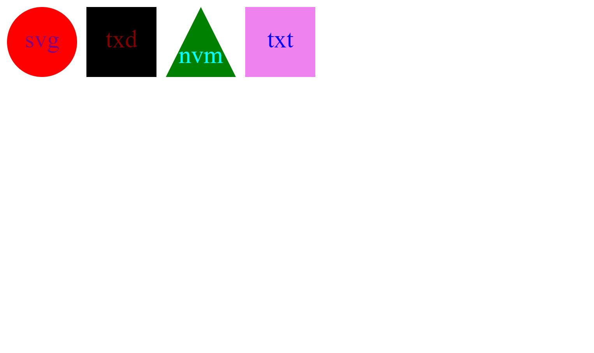

# svgLogoMaker

</a>
 

## Description

This is an svg logo maker! This little cli is created to make either a square, circle, or triangle with three characters inside with any color of your choosing! 

## Table of Contents

- [Installation](#installation)
- [Usage](#usage)
- [Questions](#Questions)

## Installation

run npm install and youll be all set to go! after an svg is created just plug it on to your html.

## Usage

  when running index.js, you will be asked 4 questions. after answering the question, an svg will be created.

## Questions

JoseTorres26
https://github.com/JoseTorres26

